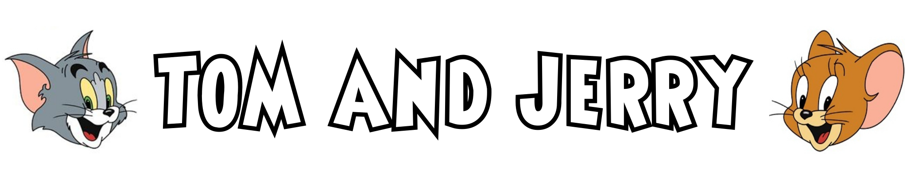

# Meet Maud {.center}

## {data-background="img/maud-introduction.svg" data-background-size="50%" data-background-position="left bottom"}

<!--
    Other resources:

    - http://rpubs.com/pviefers/CologneR [has interesting example of hierarchical model]
    - https://www.youtube.com/watch?v=s-9itaL1v-o "Extending the Power of R with Stan" [focus on rstanarm package]
    - https://vimeo.com/132156595
    - https://www.youtube.com/watch?v=qQFF4tPgeWI [Bob Carpenter. Background information. No demo of Stan.]
    - https://www.youtube.com/watch?v=uSjsJg8fcwY [Michael Betancourt - "Some Bayesian Modeling Techniques in Stan". Mostly linear models.]
    - https://www.youtube.com/watch?v=pHsuIaPbNbY [Michael Betancourt - "Efficient Bayesian inference with Hamiltonian Monte Carlo". Great background on MC.]

    - http://m-clark.github.io/docs/IntroBayes.html
    
    - https://matthewdharris.com/2016/10/18/estimating-a-beta-distribution-with-stan-hmc/
    - http://blackwell.math.yorku.ca/MATH6635/2016/Day17/MCMC_with_STAN_examples.html
    - https://stats.stackexchange.com/questions/165/how-would-you-explain-markov-chain-monte-carlo-mcmc-to-a-layperson
    - http://mlwhiz.com/blog/2015/08/19/MCMC_Algorithms_Beta_Distribution/
    - http://citeseerx.ist.psu.edu/viewdoc/download?doi=10.1.1.13.7133&rep=rep1&type=pdf
    - https://jeremykun.com/2015/04/06/markov-chain-monte-carlo-without-all-the-bullshit/
    - https://link.springer.com/article/10.3758%2Fs13423-016-1015-8
-->

```{r setup, include=FALSE, warning=FALSE, include=FALSE}
knitr::opts_chunk$set(echo = TRUE, comment = NA, fig.width = 10, fig.height = 6.5)

options(width = 120)

library(dplyr)
library(tidyr)
library(rstan)
library(ggplot2)
library(icon)
library(knitr)

# Plotting options for RStan.
#
rstan_gg_options(fill = "skyblue", color = "skyblue4", pt_color = "red")

rstan_options(rstan_warmup_bg_col="red")
```

<aside class="notes">
I'm Andrew Collier and I work as a Freelance Data Scientist at Toptal, which is a talent network for technical specialists. If anybody is interested in finding out more about opportunities at Toptal, I'd be happy to chat afterwards.

Enough about me. I want you to meet somebody.

Meet my friend Maud.

Maud is 73 years old. She likes cats and gardening.

She also has a serious gambling problem.
</aside>

## {.center}

<!-- Had a full slide background using img/slot-machine.jpg -->

```{r include=FALSE}
paytable <- data.frame(
  payout = c(0, 1, 2, 5, 10, 20, 100),
  frequency = c(700, 166, 80, 33, 15, 5, 1),
  symbol = c("", rep(c("mouse", "cat"), 3)),
  repeats = c(0, 1, 1, 2, 2, 3, 3),
  stringsAsFactors = FALSE
) %>% mutate(
  symbols = purrr::map2(symbol, repeats, function(sym, n) {ifelse(sym == "", "", emo::ji(sym)) %>% rep(n) %>% paste(collapse = "")}),
  probability = frequency / sum(frequency),
  description = ifelse(repeats == 0, "", sprintf("%dx %s", repeats, symbol))
) %>% select(frequency, payout, symbols, description)
```



```{r echo=FALSE}
paytable %>% select(description, symbols, payout) %>% kable("html")
```

<aside class="notes">
Her weakness is slot machines. She's positively obsessed by them. And she has one particular favourite called "Tom and Jerry". The only information that's publicly available about this game is the paytable. This tells you what the payout is for each of the winning combinations.
</aside>

## Maud's Burning Questions {.center}

- What is the hit rate?
- What is the RTP?
- What is the hit rate for each winning combination?

<aside class="notes">
But Maud wants to know more about her favourite game. Specifically:

- what proportion of spins result in a win (the hit rate);
- what proportion of her wager gets paid back to her on average (the RTP); and
- how the hit rate is broken down across the various winning combinations.

If she could get her hands on the uncertainties in these estimates, that would be an added bonus.
</aside>

## {data-background="img/maud-love-r.svg" data-background-size="50%" data-background-position="left bottom"}

<aside class="notes">
Somewhat surprisingly, Maud is also a big fan of R. So the two of us formed a litte study group to learn about Bayesian techniques and see if we could use them to answer those questions.
</aside>

## Maud's Data (by Session)

```{r create_data, include=FALSE}
SESSIONS <- 100
AVGSPINS <- 20

# Probability of wagering 1, 2 or 3 coins per spin.
#
COINPROB = c(0.8, 0.15, 0.05)

# Seed chosen so that first session has fewer than 10 spins.
#
set.seed(538)

sessions <- tibble(
  spins = rpois(SESSIONS, AVGSPINS)
) %>% mutate(
  # Generate samples for individual spins.
  #
  details = purrr::pmap(., function(spins) {
    data.frame(
      spin = 1:spins,
      wager = sample(1:3, spins, replace = TRUE, prob = COINPROB)
    ) %>% mutate(
      payout = sample(paytable$payout, spins, TRUE, paytable$frequency) * wager
    )
  }),
  session = 1:SESSIONS
) %>% select(session, spins, details)

sessions <- inner_join(
  sessions,
  sessions %>%
    tidyr::unnest() %>%
    group_by(session) %>%
    summarise(
      hits = sum(payout > 0),
      wager = sum(wager),
      payout = sum(payout)
    )
) %>%
  mutate(
    hit_rate = hits / spins,
    rtp = payout / wager
  ) %>%
  select(session, details, everything())
```

```{r}
sessions
```

<aside class="notes">
Fortunately Maud has diligently recorded her gambling statistics. As a result we have a rich data set to play with. At the session level the most important bits of information are the number of spins and the associated number of hits. We also have the total wager and payout for each session.
</aside>

## Maud's Data (by Spin)

```{r}
spin <- sessions %>%
  select(session, details) %>%
  unnest() %>%
  mutate(success = as.integer(payout > 0))
```
```{r echo=FALSE}
spin
```

<aside class="notes">
We can also unpack these data down to the level of individual spins, where we have something that could be modelled as a Bernoulli process.

So let's kick off by addressing Maud's first question.
</aside>

# Q1: Hit Rate {.center}

## {.center}

Probability distribution for binomial process:

$$
P(k | n, \theta) = \binom{n}{k} \theta^k (1 - \theta)^{n - k}
$$

where

- $k$ successes in $n$ trials; and
- the probability of success on any trial is $\theta$.

Multiple experiments: for session $i$ there are $k_i$ hits from $n_i$ spins.

<aside class="notes">
At the session level the relationship between spins and hits can be modelled as a binomial process. For each session we are considering the number of spins (or "trials") denoted by $n$ and the number of hits (or "successes") denoted by $k$. And $\theta$ is the probability of success on any spin.

The binomial distribution allows us to calculate the probability of $k$ given specific values for $n$ and $\theta$. So this assumes that you know $\theta$... But what if you don't? Certainly for most slot machines you don't know the probability of winning. If you did then you probably wouldn't be very tempted to play.

Suppose we had observations of $k$ and $n$, and wanted to estimate $\theta$.
</aside>

## {.center}

Probability distribution for Bernoulli process:

$$
P(k | \theta) = \theta^k (1 - \theta)^{1 - k}
$$

where

- $k = 0$ indicates failure;
- $k = 1$ indicates success; and
- the probability of success on any trial is $\theta$.


<aside class="notes">
A Bernoulli process is the atomic component of a binomial process and it considers a single trial at a time.
</aside>

## Bayes' Theorem {data-background="img/maud-homie.svg" data-background-size="50%" data-background-position="right bottom"}

$$
p(\theta|y, X) = \frac{p(y|X, \theta) p(\theta)}{p(y)} \propto p(y|\theta) p(\theta)
$$
where

- $y$ are observations;
- $X$ are predictors;
- prior — $p(\theta)$;
- likelihood — $p(y|X, \theta)$; and
- posterior — $p(\theta|y, X)$.
<!--
- likelihood — $p(y|X, \theta)$ is probability of data <em>given</em> parameters;
- prior — $p(\theta)$ is parameter distribution <em>before</em> data; and
- posterior — $p(\theta|y, X)$ is parameter distribution <em>given</em> data.
-->

<aside class="notes">
Our plan was to use Bayesian techniques to extract the parameters for these distributions.

Maud is quite familiar with these techniques but I had to remind myself of how it all works.

Bayes Theorem relates three important components: a prior, likelihood and posterior.

The prior specifies what we know about the model parameters before considering the data.

The likelihood gives the probability of the data conditional on the model and choice of parameter.

The posterior is what we know about the model parameters after factoring in the data.

A powerful feature is that this can be applied iteratively, with the posterior from one iteration becoming the prior in the following iteration.

Despite the apparent simplicity of this relationship it has historically been rather difficult to apply due to computational challenges.

**Note:**

The denominator is sometimes called the "Evidence". It's just the marginal distribution of $y$.

So much for theory. Analytical expressions are rare in practice.

Confounding features:

- data are often multi-dimensional;
- models have multiple parameters.

So evaluating $p(\theta|y, X)$ becomes challenging!
</aside>

---

```{r echo=FALSE}
binom_likelihood <- function(theta, k, n) {
  prod(theta^k * (1 - theta)^(n - k))
}

# theta - probability [single value]
# k - number of successes [vector]
# n - number of trials [vector]
#
binom_log_likelihood <- function(theta, k, n) {
  sum(k * log(theta) + (n - k) * log(1 - theta))
}
```

```{r include=FALSE}
prior <- tibble(
  theta = seq(0, 1, 0.02),
  update = 0,
  prior = NA
)

prior_unif <- prior %>% mutate(
  posterior = 1,
  # Normalise.
  posterior = posterior / sum(posterior)
)
prior_beta <- prior %>% mutate(
  posterior = dbeta(theta, 8, 4),
  # Normalise.
  posterior = posterior / sum(posterior)
)

rm(prior)

binom_update <- function(prior, k, n) {
  likelihood <- sapply(prior$theta, binom_likelihood, k, n)
  #
  prior %>% mutate(
    prior = posterior,
    # Update.
    posterior = likelihood * prior,
    # Normalise.
    posterior = posterior / sum(posterior)
  )
}

# plot(p ~ theta, prior_unif)
# plot(p ~ theta, binom_update(prior_unif, 1, 3))

# plot(p ~ theta, prior_beta)
# plot(p ~ theta, binom_update(prior_beta, 1, 3))
```

```{r binomial_updates_uniform, echo=FALSE, message=FALSE, warning=FALSE}
for (n in 1:11) {
  hits = sessions[[n, "hits"]]
  spins = sessions[[n, "spins"]]
  prior_unif <- rbind(prior_unif, binom_update(prior_unif %>% filter(update == n - 1), hits, spins) %>% mutate(update = update + 1))
  prior_beta <- rbind(prior_beta, binom_update(prior_beta %>% filter(update == n - 1), hits, spins) %>% mutate(update = update + 1))
}

ggplot(prior_unif, aes(x = theta)) +
  geom_line(aes(y = prior), lty = "dashed") +
  geom_line(aes(y = posterior)) +
  geom_point(aes(y = posterior), size = 1) +
  facet_wrap(~ update, scales = "free_y") +
  scale_y_continuous("") +
  scale_x_continuous(breaks = seq(0, 1, 0.2)) +
  theme_classic() +
  theme(axis.text.y = element_blank(), axis.ticks.y = element_blank())
```

<aside class="notes">
One approach to applying Bayes' Theorem is to use a regular grid of parameter values. This works well and you can see that the shape of the posterior (as represented by points on the grid) evolves with each iteration.

But there's a major problem with the grid approximation: it scales poorly with the number of model parameters and rapidly becomes intractable.
</aside>

```{r binomial_updates_beta, eval=FALSE, include=FALSE}
ggplot(prior_beta, aes(x = theta, y = p)) +
  geom_line() +
  geom_point(size = 1) +
  facet_wrap(~ update, scales = "free_y") +
  theme_classic()
```

## {.center}


Stan:

- http://mc-stan.org/
- https://github.com/stan-dev/stan

RStan:

- https://github.com/stan-dev/rstan

<aside class="notes">
We're not going to stress about the details of Markov chains because we'll be using a remarkable piece of software called Stan.

Stan is a high level language for writing statistical models. There's a package for it in R. Both are being aggresively developed.

**Note:**

It uses Hamiltonian Monte Carlo, which applies some general principles from Physics to provide much more efficient sampling. Yes, it takes a little longer to generate each sample, but those samples are guaranteed to explore parameter space much more effectively.

The Hamiltonian MC is *much* more efficient than vanilla MCMC or the Metropolis Algorithm.
</aside>

## Stan Workflow {.center}

1. Choose a model.
2. Write Stan program (likelihood and priors).
3. Stan parser converts this to C++.
4. Compile C++.
5. Execute compiled binary.
6. Evaluate results. Optionally return to 2.
7. Inference based on posterior sample.

To use `rstan` you need a `.stan` `r icon::fa("file")` and a `.R` `r icon::fa("file")`.

<aside class="notes">
This is the basic process for working with Stan.

1. Select a model which seems appropriate to data.
2. Encode the model in Stan modeling language.
3. Translate the Stan program to C++ code.
4. Compile the C++ code.
5. Use the compiled code to sample from the posterior distribution. This is where the magic happens.
6. Ensure that results are meaningful. In not, iterate.
7. Use the posterior sample to do inference.

Stan is a standalone system. However it's a lot easier to run it from within R.
</aside>

## Stan Skeleton {.center}

<script src="https://gist.github.com/DataWookie/61d7a662ecaad87044e1c9f161a5245f.js"></script>

<aside class="notes">
We'll start by building a model to address Maud's first burning question: what is the hit rate?

This is the basic structure of a Stan file. It consists of a number of blocks, not all of which are required.

The most important blocks are:

- `data` which specifies the observations;
- `parameters` which lists the parameters of the model; and
- `model` which defines the likelihood and priors.
</aside>

## {.center}

```{r echo=FALSE, cache=FALSE}
read_chunk("bernoulli.stan")
```

```{text stan_bernoulli, message=FALSE, warning=FALSE, eval=FALSE}
```

<aside class="notes">
Our first Stan model has two elements of data: the number of samples and the outcomes of the individual spins, encoded as a binary vector.

We know that `theta` must lie between 0 and 1.

We specify a Bernoulli likelihood.

We haven't given a prior on `theta`, so by default Stan will use a uniform prior: any value of `theta` is equally likely.
</aside>

## {.center}

```{r message=FALSE, warning=FALSE, results='hide', cache=TRUE}
library(rstan)

# Use all available cores.
#
options(mc.cores = parallel::detectCores())

trials <- list(
  N       = nrow(spin),
  y       = spin$success
)

fit <- stan(
  file    = "bernoulli.stan",
  data    = trials,
  chains  = 2,                         # Number of Markov chains
  warmup  = 500,                       # Warmup iterations per chain
  iter    = 1000                       # Total iterations per chain
)
```

<aside class="notes">
This is the corresponding R code. Things to note:

- it loads the `rstan` library;
- data are transferred to Stan via a list (with names corresponding to those in the Stan file);
- Stan is invoked via the `stan()` function; and
- specify the number of chains as well as number of warmup and compute iterations per chain.

The "chains" are initially a little mysterious, but these are basically just independent series of samples. They aid better sampling of parameter space and also facilitate parallelism.

The warmup is a number of iterations during which the distribution should, in principle, achieve an equilibrium.

Note that there are 1000 iterations in total per chain, of which 500 are warmup, which leaves 500 active iterations. So, in total there are 1000 (2 times 500) active iterations.

**Note:**

Set the number of cores to be used for parallel execution (otherwise chains are run in series).
</aside>

---

```{r traceplot_binomial, echo=FALSE}
estimate_hit_rate = summary(fit)$summary[1, 1]

traceplot(fit, pars = c("theta"), inc_warmup = TRUE) + scale_y_continuous(expression(theta))
```

<aside class="notes">
A traceplot shows the sampled values as a function of iteration number.

Let's take a moment to see where those samples came from. We specified 2 chains, each with 500 warmup iterations and 1000 iterations in total, leaving 500 active iterations per chain. So that accounts for the 1000 samples in the `stanfit` object.

The chains are uncorrelated, but successive samples within each chain are clearly related to each other. Ideally we are aiming for good "mixing" across the domain of the distribution.

What's happening during the warmup phase? The parameters of the MC are getting tuned to optimally explore the parameter space (one aspect of this is choosing the step size). By the time that the active iterations start the sampler should have more or less reached an equilibrium.
</aside>

---

```{r eval=FALSE, include=FALSE}
samples <- extract(fit)

names(samples)

samples$theta %>% head()
```

```{r}
class(fit)

samples <- as.data.frame(fit)

head(samples)

nrow(samples)
```

<aside class="notes">
We don't actually get the posterior directly. The `stanfit` object is really just a collection of samples from the posterior.

**Note:**

We can access the samples using the `extract()` function, which yields a list. It's normally easier to just convert these samples to a data frame.

The number of samples that we get is precisely the total number of active iterations across all chains.
</aside>

## {.center}

```{r density_binomial, eval=FALSE, include=FALSE}
plot(fit, show_density = TRUE, ci_level = 0.5, fill_color = "purple")
```

```{r hist_binomial, echo=FALSE}
plot(fit, plotfun = "hist", pars = c("theta"), include = TRUE, binwidth = 0.0025) + scale_x_continuous(expression(theta))
```

<aside class="notes">
The samples for success probability look like they have a Normal distribution and are centred on the value that we expected from earlier analysis, around 30%.
</aside>

## {.center}

```{r}
print(fit, probs = c(0.025, 0.5, 0.975))
```

Use `summary()` to get information for each chain.

<aside class="notes">
This is very neatly presented in the `stanfit` summary information.

There's the mean value of `theta` as well as the lower and upper quantiles of the distribution. Don't think of a confidence interval. These are quantiles of the density. Close to the median they are stable, but further into the tails they can be noisy.

The average hit rate is in good agreement with our earlier result.

Maud is immediately more comfortable with this result because, even with a uniform prior, the success rate is constrained to a reasonable domain between 0 and 1.

`n_eff` is the effective sample size. This takes into account that the samples are not independent (this is a consequence of correlation in the Markov Chain). This is a vital component of the Monte Carlo version of the Central Limit Theorem.

We can see the degree of correlation in a simple autocorrelation plot.
</aside>

## {.center}

```{r echo=FALSE, cache=FALSE}
read_chunk("binomial-beta-prior.stan")
```

```{text stan_binomial_beta_prior, message=FALSE, warning=FALSE, eval=FALSE}
```

<aside class="notes">
Let's take a look at the session data. We need to treat these data as coming from a binomial distribution.

The data that we are providing consists of two vectors, `hits` and `spins`.

We are assuming a binomial relationship between `hits` and `spins` with a success probability denoted by the parameter `theta`.

As an experienced gambler Maud knows that the likelihood of the hit rate was not uniformly distributed between 0 and 1. We could have factored this knowledge into the computation by applying a more informed prior. For example, a broad beta distribution peaked at 0.5. The results are essentially unchanged though.

**Note:**

- The ~ represents a stochastic relationship. An = would indicate a deterministic relationship.
- The beta distribution is the conjugate prior for the binomial likelihood (this means that the corresponding posterior will also be a beta distribution).
</aside>

```{r message=FALSE, warning=FALSE, cache=TRUE, include=FALSE, results='hide'}
library(rstan)

# Use all available cores.
#
options(mc.cores = parallel::detectCores())

trials <- list(
  N       = nrow(sessions),
  hits    = sessions$hits,
  spins   = sessions$spins
)

fit <- stan(
  file    = "binomial-beta-prior.stan",
  data    = trials,
  chains  = 2,
  warmup  = 500,
  iter    = 1000
)
```

## {.center}

```{r}
print(fit, probs = c(0.025, 0.5, 0.975))
```

<aside class="notes">
This is very neatly presented in the `stanfit` summary information.

There's the mean value of `theta` as well as the lower and upper quantiles of the distribution. Don't think of a confidence interval. These are quantiles of the density. Close to the median they are stable, but further into the tails they can be noisy.

The average hit rate is in good agreement with our earlier result.

Maud is immediately more comfortable with this result because, even with a uniform prior, the success rate is constrained to a reasonable domain between 0 and 1.

`n_eff` is the effective sample size. This takes into account that the samples are not independent (this is a consequence of correlation in the Markov Chain). This is a vital component of the Monte Carlo version of the Central Limit Theorem.

We can see the degree of correlation in a simple autocorrelation plot.
</aside>

## {.center}

```{r autocorrelation, echo=FALSE, message=FALSE, warning=FALSE}
# Autocorrelation between successive samples.
#
plot(fit, pars = "theta", plotfun = "ac") +
  scale_y_continuous("Average Autocorrelation")
```

<aside class="notes">
The nature of MCMC is that successive samples of the parameters are correlated. As a result the samples cannot be considered as independent and so we need to adjust the sample count accordingly.

Let's move onto Maud's second burning question, quantifying the RTP. 
</aside>

# Q2: RTP {.center}

---

```{r hist_rtp, echo=FALSE, cache=TRUE}
ggplot(sessions, aes(x = rtp)) +
  # geom_histogram(binwidth = 0.2, boundary = 0, fill = "skyblue") +
  geom_histogram(aes(y = ..density..), binwidth = 0.2, boundary = 0, fill = "skyblue") +
  geom_vline(xintercept = c(0.5, 1.0), lty = "dashed") +
  scale_x_continuous("RTP", labels = scales::percent) +
  scale_y_continuous("Density") +
  theme_classic()
```

<aside class="notes">
In an ideal world RTP would be close to 1. However, this is not the case. A lower RTP obviously favours the casino.

Looking at the distribution of RTP values we can see that there is appreciable variation between sessions. We'd like to quantify the mean RTP and get an idea of the associated uncertainties.

Now this distribution is definitely not Normal. The long tail is a dead giveaway. Maybe it could be described by a log-Normal though? This makes sense too based on the multiplicative nature of slot machine returns.
</aside>

## {.center}

```{r echo=FALSE, cache=FALSE}
read_chunk("lognormal-rtp.stan")
```

```{text stan_lognormal_rtp, message=FALSE, warning=FALSE, eval=FALSE}
```

<aside class="notes">
Now our Stan code specifies a log-Normal for the likelihood, with two parameters, `mu` and `sigma`.

We're not going to specify a prior for either of the model parameters, but simply constrain them to being positive real numbers.

**Note:**

- The mean of `lognormal()` is `exp(mu + sigma * sigma / 2)`.
</aside>

```{r cache=TRUE, include=FALSE}
trials <- list(
  N       = nrow(sessions),
  rtp     = sessions$rtp
)

fit <- stan(
  file    = "lognormal-rtp.stan",
  data    = trials,
  chains  = 4,
  warmup  = 1000,
  iter    = 2000
)
```

```{r pairs_rtp, eval=FALSE, include=FALSE}
pairs(fit, pars = c("mu", "sigma", "lp__"), las = 1)
```

<!--
<aside class="notes">
A pairs plot lets us interrogate the results. It's clear that both of the model parameters are correlated with the log likelihood, but apparently independent of each other. We've assumed that the parameters are independent, so this is good.
</aside>
-->

---

```{r hist_rtp_simulated, echo=FALSE, warning=FALSE, cache=TRUE}
simulated <- tibble(rtp = extract(fit, "simulated") %>% unlist())

ggplot(sessions, aes(x = rtp)) +
  geom_histogram(aes(y = ..density..), binwidth = 0.2, boundary = 0, fill = "skyblue") +
  geom_histogram(data = simulated, aes(x = rtp, y = ..density..), binwidth = 0.05, boundary = 0, alpha = 0.125, col = "black") +
  geom_vline(xintercept = c(0.5, 1.0), lty = "dashed") +
  scale_x_continuous("RTP", labels = scales::percent, limits = c(0, 5)) +
  scale_y_continuous("Density") +
  theme_classic()
```

<aside class="notes">
It's good practice to do a posterior predictive check. We do this by generating simulated samples from the posterior distribution. These samples are specified in the `generated quantities` block. It looks like there is pretty good agreement between the data and the model.

These simulated values take into account the uncertainties in the model parameters too.
</aside>

## {data-background="img/maud-not-cricket.svg" data-background-size="50%" data-background-position="right bottom"}

```{r echo=FALSE}
rtp_summary = summary(fit, pars = c("mu","sigma"))$summary

estimate_rtp = rtp_summary[1, 1]

print(fit, pars = c("mu", "sigma", "lp__"))
```

<aside class="notes">
The average RTP is around `r sprintf("%.0f", estimate_rtp * 100)`%.
</aside>

## Here's the Kicker {.center}

What's the probability of breaking even?

```{r}
mean(simulated$rtp > 1)
```

What's the probability of doubling your money?

```{r}
mean(simulated$rtp > 2)
```

<aside class="notes">
Since we have access to the posterior distribution we are able to calculate all manner of statistics without relying on (poor) asymptotic approximations. For example, we can find the probability of breaking even or doubling our money.

These figures are enough to make Maud reconsider her gambling fixation.
</aside>

# Q3: Hit Rate per Combination {.center}

## {.center}


```{r echo=FALSE}
paytable %>% select(description, symbols, payout) %>% kable("html")
```

---

```{r echo=FALSE, cache=FALSE}
read_chunk("lognormal-rtp-hit-rate.stan")
```

```{text stan_normal_rtp_hit_rate, message=FALSE, warning=FALSE, eval=FALSE}
```

<aside class="notes">
Maud got the idea for this while pruning her roses. The idea is to use the observations of RTP per session to infer the relative frequency of the winning combinations. Since we know the payout for each combination it seems like this might be possible, but I was not convinced that we had enough information.

We've defined a vector of rate parameters, `theta`, and another parameter, `pay`, which is derived from them. The relationship shows up in the `transformed parameters` block and the six different payouts are used as weights.

The priors are based on Maud's gut feel for the relative frequency of each of the payouts. They carry a little information about the probabilities of each payline, but not a lot.
</aside>

```{r cache=TRUE, include=FALSE}
trials <- list(
  N       = nrow(sessions),
  rtp     = sessions$rtp
)

fit <- stan(
  file    = "lognormal-rtp-hit-rate.stan",
  data    = trials,
  chains  = 4,
  warmup  = 1000,
  iter    = 2000
)
```

```{r traceplot_rtp, eval=FALSE, include=FALSE}
traceplot(fit, pars = paste0("theta[", 1:6, "]"), inc_warmup = TRUE, nrow = 3)
```

<aside class="notes">
The traceplot paints an interesting picture. It's readily apparent here the importance of the warmup iterations: the first few samples for some of the parameters are very far from the core of their distribution. This could be improved by providing more restrictive priors.
</aside>

## {.center}

```{r echo=FALSE}
(rtp_summary = summary(fit, probs = c(0.025, 0.975), pars = c(paste0("theta[", 1:6, "]")))$summary)
```

The 1x payout is triggered on average every `r format(1 / rtp_summary[1, 1], digits = 0)` spins.

The 100x payout is triggered on average only every `r format(1 / rtp_summary[6, 1], digits = 3)` spins.

<aside class="notes">
The results are interesting. We've derived values for the frequency of each of the winning combinations. Granted there is some uncertainty in those values, but not much.

The small payouts are relatively frequent (designed to keep you playing the game) but the big payouts are rather rare.

These are the vital statistics for determining the characteristics of the game. So we have effectively reverse engineered it.
</aside>

# Exit Maud! {data-background="img/maud-crochet.svg" data-background-size="50%" data-background-position="left bottom"}

<aside class="notes">
She's going to take up a more conservative and age-appropriate hobby.

Maud is going to start indulging in more sedate and age-appropriate hobbies like crochet.
</aside>

## Why Stan? {.center}

- Extract maximum information from your data.
- Learning curve is not as steep as you might think.

<aside class="notes">
We could have got most of these results using frequentist techniques, so why use Stan?

Maud can do it. I can do it. And so can you.
</aside>

## {.center}

<div style="text-align: center; font-size: 1.5em;">Do</div>
<div style="text-align: center; font-size: 3.0em; color: #3498db;">cool things</div>
<div style="text-align: center; font-size: 1.5em;">with</div>
<div style="text-align: center; font-size: 3.0em; color: #3498db;">Stan!</div>

<div class="author-info" style="margin-top: 3em;"><i class="fa fa-envelope"></i> andrew@exegetic.biz | <i class="fab fa-twitter"></i> <a href="https://twitter.com/DataWookie">DataWookie</a> | <i class="fab fa-github"></i> <a href="https://github.com/DataWookie">DataWookie</a></div>

<aside class="notes">
I've really just scratched the surface and can't claim to have done Bayes or Stan any real justice. But I hope that if you haven't tried it before you'll take a gamble. I can assure you that your RTP will be greater than one.

**Note:**

So these are not black box Machine Learning models where we simply want to make the best possible predictions. Here we actually care what's going on inside the box.
</aside>

<!-- ============================================================================================================== -->
<!-- ===                                                                                                        === -->
<!-- === END OF TALK                                                                                            === -->
<!-- ===                                                                                                        === -->
<!-- ============================================================================================================== -->

# Extra Stuff

## Metropolis-Hastings Algorithm

1. Randomly sample $\theta^{(0)}$.
2. Set $i = 1$.
3. Randomly sample proposal $\theta^{*}$ in the vicinity of $\theta^{i-1}$.
4. Sample $u$ uniformly on $[0, 1)$.
5. 

$$
\theta^{(i)} = \left\{\begin{array}{ll}
\theta^{*} & \text{if } u \cdot p(\theta^{i-1}|y, X) < p(\theta^{*}|y, X) \\
\theta^{(i-1)} & \text{otherwise.}
\end{array}\right.
$$

6. Increment $i$.
7. Return to 1.

<aside class="notes">
The Metropolis-Hastings Algorithm is the classical implementation of MCMC.

The algorithm proceeds by sampling a proposal point in the vicinity of the current point and then either accepting or rejecting that point depending on the ratio of the probability density at the two points. If the probability of the new point is higher then we always accept. If it's lower then we accept with a probability that is the ratio of the densities.

It might occur to you that the samples are now no longer independent. And you'd be completely correct. We'll see how this is accounted for.

Metropolis Monte Carlo is better than the Grid Approximation. However in an absolute sense it's not really all that good. Especially not in higher dimensions, where it can take a very long time to sample the parameter space.

**Note:**

The size of the "vicinity" (effectively the step size) determines the acceptance rate of new points. If it's too large then few new points will be accepted. If it's too small then the rate of diffusion will be painfully slow.

Without step 3 this would essentially give us diffusion, a random walk. But this step, the Metropolis Acceptance Procedure, ensures that sampling converges to the underlying distribution.

The principle advantage of MCMC is that we don't need to know the maximum value of the posterior.

Also it only depends on the ratio of posteriors, so these do not need to be normalised.
</aside>

```{r eval=FALSE, include=FALSE}
# A simple implementation of the Metropolis-Hastings algorithm.

N = 4000

proposal <- function(theta) {
  rnorm(1, theta)
}

posterior <- function(theta) {
  dbeta(theta, 7, 4)
}

chain <- vector(mode = "numeric", length = N)
chain[1] = 0.5
#
for (n in 2:N) {
  star = proposal(chain[n-1])
  u = runif(1)
  #
  if (u < posterior(star) / posterior(chain[n-1])) {
    chain[n] = star
  } else {
    chain[n] = chain[n-1]
  }
}

chain = data.frame(
  n = 1:N,
  theta = chain
) %>% mutate(
  batch = (n - 1) %/% 1000 
)

ggplot(chain, aes(x = n, y = theta)) +
  geom_line() +
  scale_y_continuous(limits = c(0, 1))
```
  
## Poisson

```{r stan_poisson, message=FALSE, warning=FALSE, results='hide', cache=TRUE}
# trials <- list(
#   N       = nrow(sessions),
#   spins   = sessions$spins
# )
# 
# fit <- stan(
#   file    = "poisson.stan",
#   data    = trials,
#   chains  = 4,
#   warmup  = 1000,
#   iter    = 2000
# )
```

---

```{r}
# extract(fit)

# hist(extract(fit)$lambda)
```

<aside class="notes">
</aside>

## Regression

```{r}
# ggplot(sessions, aes(spins, wager)) + geom_jitter()
```

## Regression Stan

```{r echo=FALSE, cache=FALSE}
read_chunk("regression.stan")
```

```{text stan_regression, message=FALSE, warning=FALSE, eval=FALSE}
```

<aside class="notes">
Because the number of spins has been standardised, the intercept will be the wager for the average number of spins.
</aside>

## Regression Stan R

```{r cache=TRUE, include=FALSE}
# trials <- list(
#   N       = nrow(sessions),
#   x       = scale(sessions$spins)[,1], # Standardised covariate
#   y       = sessions$wager
# )
# 
# fit <- stan(
#   file    = "regression.stan",
#   data    = trials,
#   chains  = 4,
#   warmup  = 1000,
#   iter    = 2000
# )
```

```{r}
# summary(fit)
```

<aside class="notes">
In a linear model we are saying that the response is normally distributed with a mean that depends on the covariates and a constant standard deviation. Assuming homogeneous noise.

The half-Cauchy is essentially a one-sided, heavy tailed version of the Normal distribution. This constrains the value of sigma to be positive but is not as restrictive as a Normal distribution.
</aside>

---

<blockquote>
... the theory of inverse probability is founded upon error and must be wholly rejected.
<cite>Sir Ronald Fisher (1925)</cite>
</blockquote>

<aside class="notes">
Not everybody's a fan of the Bayesian approach. Ronald Fisher, had this to say about inverse probability as Bayesian inference was known in his day.

Possibly one of the reasons for their skepticism is that historically it has been computationally challening to actually *apply* these techniques. This is no longer true.

In general you can't apply Bayesian techniques analytically.
</aside>

## {.center}

$$
\text{hit rate} = \theta^* = \frac{\text{total hits}}{\text{total spins}} = \frac{\sum_i k_i}{\sum_i n_i}
$$

```{r}
with(sessions, sum(hits) / sum(spins))
```

<aside class="notes">
Well $\theta$ is just the expected number of hits per spin. So we could lump all of the data together and treat it as a single massive experiment, taking the ratio of the total number of hits to the total number of spins across all sessions.

This would certainly maximise the amount of data and should, in principle, give us a reasonably accurate result. But there is no way to quantify our uncertainty.
</aside>

## {.center}

$$
\text{hit rate for session } i = \theta^*_i = \frac{k_i}{n_i}
$$

## {.center}

```{r hit_rate_histogram, echo=FALSE, message=FALSE, warning=FALSE, fig.height=3}
ggplot(sessions, aes(x = hit_rate)) +
  geom_histogram(binwidth = 0.05) +
  scale_x_continuous("Hit Rate per Session", limits = c(0, 1), labels = scales::percent) +
  scale_y_continuous("Frequency") +
  theme_classic()

session_summary <- sessions %>% summarise(
  session_avg = mean(hit_rate),
  session_std = sd(hit_rate)
) %>% mutate(
  ci_lower = session_avg - 2 * session_std / sqrt(SESSIONS),
  ci_upper = session_avg + 2 * session_std / sqrt(SESSIONS)
)
```

```{r echo=FALSE}
session_summary %>% select(session_avg, session_std)
```

95% confidence interval extends from `r format(session_summary$ci_lower * 100, digits = 3)`% to  `r format(session_summary$ci_upper * 100, digits = 3)`%.

<aside class="notes">
Another approach is to treat each session as an independent experiment, each of which yields an estimate for the hit rate. Now we can calculate both mean and variance, and hence a confidence interval on the hit rate.

Maud is fairly happy with this result, but it does concern her that the confidence interval on the hit rate could, in principle, extend to values less than zero or greater than one. Neither of which is physically possible.
</aside>

## {.center}

```{r include=FALSE}
y <- c(0, 1, 0, 0, 1, 1, 0)

# Log-likelihood of a parameter value given the data.
#
bernoulli_log_likelihood <- function(theta, y) {
  sum(y * log(theta) + (1 - y) * log(1 - theta))
}

bernoulli_log_likelihood(0.3, y)
bernoulli_log_likelihood(0.6, y)
```

```{r include=FALSE}
binom_probability <- function(theta, k, n) {
  prod(choose(n, k) * theta^k * (1 - theta)^(n - k))
  #
  # Equivalent to dbinom(k, size = n, prob = theta)
}
```

Assuming that sessions $i = 1, 2, 3, \ldots$ are independent:

$$
P(k | n, \theta) = \prod_i P(k_i | n_i, \theta) = L(\theta; n, k)
$$

<aside class="notes">
Let's consider another approach: the joint probability distribution for all of the sessions lumped together. If we assume that they are independent, which is a reasonable assumption, then we can simply multiply together the distributions for each session. This gives us, one the one hand, a distribution for the number of hits in each of the sessions. But if we think of this as a function of $\theta$ then it's the likelihood of a particular value of $\theta$ given observed values of $k_i$ and $n_i$.

If we maximise this function then we have the most likely value of $\theta$ based on the data.

**Note:**

$P(k | n, \theta)$ and $L(\theta; n, k)$ are functionally equivalent but

- $P(k | n, \theta)$ is a function of $k$ (and is a probability distribution) and
- $L(\theta; n, k)$ is a function of $\theta$ (and is *not* a probability distribution).
</aside>

## {.center}

Log-likelihood for binomial process (multiple trials):

$$
LL(\theta; n, k) = \sum_i k_i \log{\theta} + (n_i - k_i) \log{(1 - \theta)}
$$

<aside class="notes">
However we'd be multiplying together a collection of small numbers, which would mean that we would rapidly lose precision. Instead we work with the log likelihood.

**Note:**

- Neglect the binomial coefficient since it's a constant (as a function of theta).
- Because the logarithm is a strictly increasing function, the log likelihood is maximised in the same place as the likelihood.
</aside>

---

```{r include=FALSE}
binom_log_likelihood(0.6, sessions$hits, sessions$spins)
binom_log_likelihood(0.6, sessions$hits, sessions$spins)

parameters <- tibble(theta = seq(0, 1, 0.01)) %>%
  mutate(
    log_likelihood = sapply(theta, binom_log_likelihood, sessions$hits, sessions$spins)
  )
```

```{r binomial_log_likelihood, echo=FALSE, fig.height=3.5, warning=FALSE}
ggplot(parameters, aes(theta, log_likelihood)) +
  geom_point() +
  geom_vline(xintercept = parameters[which.max(parameters$log_likelihood),]$theta, lty = "dashed") +
  scale_x_continuous(expression(theta)) +
  scale_y_continuous("Log likelihood", limits = c(-6000, -1000)) +
  theme_classic()
```

```{r echo=FALSE}
parameters %>% arrange(desc(log_likelihood)) %>% head()
```

<aside class="notes">
If we plot the log-likelihood as a function of $\theta$ then it's a simple matter to identify the most probable value.

In the Maximum Likelihood approach we simply select the value of the parameter which gives the largest likelihood.

This gives us a point estimate for $\theta$ with no indication of uncertainty. However, the likelihood is a tool which will allow us to get a much better characterisation of the hit rate.

**Note:**

The assumption implicit in this approach is that in the absence of data all parameter values are equally probable.
</aside>

## Maud's Bayesian Answers {.center}

- What is the hit rate? **`r sprintf("%.1f", estimate_hit_rate * 100)`%**
- What is the RTP? **`r sprintf("%.1f", estimate_rtp * 100)`%**
- What is the hit rate for each winning combination?
    - **frequent low paying combinations (every `r format(1 / rtp_summary[1, 1], digits = 0)` spins for 1x)**
    - **rare high paying combinations (every `r format(1 / rtp_summary[6, 1], digits = 3)` spins for 100x)**

<aside class="notes">
So, returning to Maud's three burning questions, not only have we managed to obtain point estimates to answer each of them, but we have actually generated distributions for each of these quantities, which are enormously more informative. With this kind of information in hand it becomes relatively simple to reverse engineer such a game.
</aside>


## Monte Carlo (Plain Vanilla Version)

Generate independent samples of $\theta^{(i)}$.

- Need to have $p(\theta^{(m)} | y, X)$.

```{r echo=FALSE, warning=FALSE, fig.height=4.5, fig.align='right'}
set.seed(13)

parameters <- tibble(
  x1 = c(NA, rnorm(20)),
  y1 = c(NA, rnorm(20))
) %>% mutate(
  x2 = c(na.omit(x1), NA),
  y2 = c(na.omit(y1), NA)
)

ggplot(parameters) +
  geom_point(aes(x = x1, y = y1), color = "red", size = 3) +
  labs(x = "", y = "") +
  theme_classic() +
  theme(axis.text = element_blank(), axis.ticks = element_blank(), axis.line = element_blank(), aspect.ratio = 1)
```

<aside class="notes">
Monte Carlo is an alternative technique which generates independent, random samples from the parameter space.

Although it's better in higher dimensions than the grid approximation, it's still far from perfect.

However there's yet another alternative...

**Note:**

The objective is to jump around parameter space in such a way that the probability of being at a point is proportional to the distribution.

Efficient algorithms exist for doing this with simple distributions. However, any non-trivial distribution will generally require you to apply something like rejection sampling. And to make that efficient we'd need to know the maximum value of the distribution.
</aside>

## Markov Chain Monte Carlo (MCMC)

Generate a series of samples: $\theta^1$, $\theta^2$, $\theta^3$, ... $\theta^M$.

- $\theta^m$ depends on $\theta^{m-1}$.
- Need to have $p(\theta^{m} | \theta^{m-1}, y, X)$.

```{r echo=FALSE, warning=FALSE, fig.height=4.5, fig.align='right'}
ggplot(parameters) +
  geom_segment(aes(x = x1, y = y1, xend  = x2, yend = y2), lty = "dashed") +
  geom_point(aes(x = x1, y = y1), color = "red", size = 3) +
  labs(x = "", y = "") +
  theme_classic() +
  theme(axis.text = element_blank(), axis.ticks = element_blank(), axis.line = element_blank(), aspect.ratio = 1)
```

<aside class="notes">
Markov Chain Monte Carlo generates a sequence of samples where each new sample is random but also dependent on the previous sample.
</aside>

## ShinyStan

library(shinystan)
launch_shinystan(fit)
#
# Diagnose -> PPcheck "Posterior predictive check" (look at distribution of observed data versus replications - do they look similar? "If our model is a good fit then we should be able to use it to generate data that looks a lot like the data we observed.")

## Resources

- http://mc-stan.org/workshops/
- <a href="http://mc-stan.org/">Stan web site</a>
- <a href="http://www.mcmchandbook.net/HandbookChapter5.pdf">MCMC Using Hamiltonian Dynamics</a> (Radford Neal)
- Blogs:
  - <http://andrewgelman.com/>